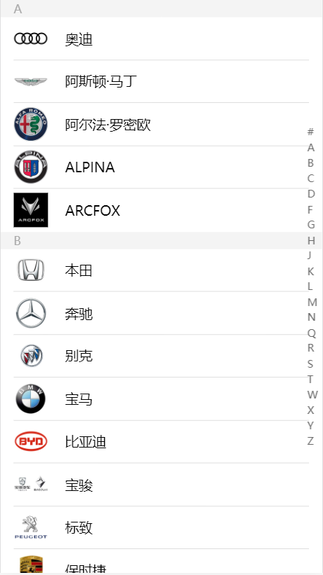
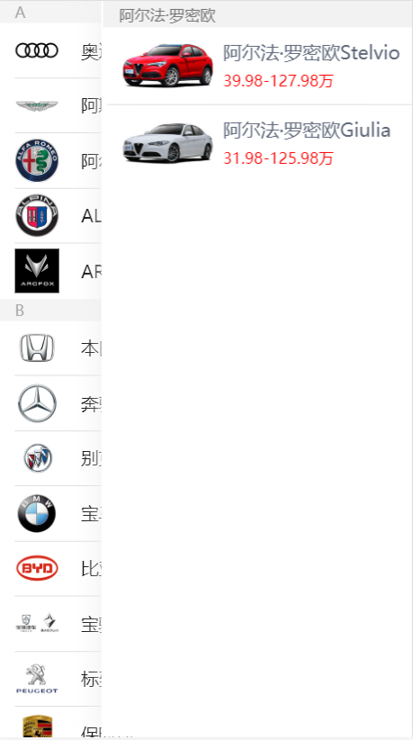
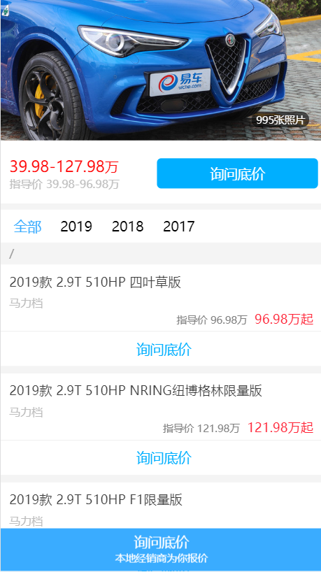
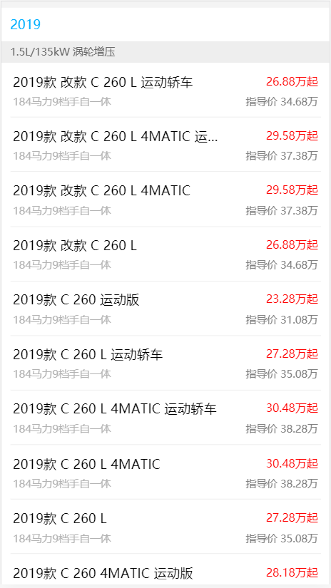
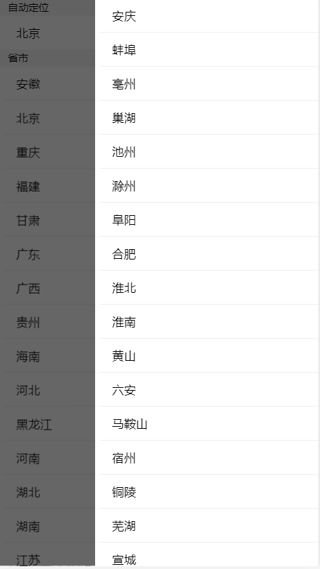
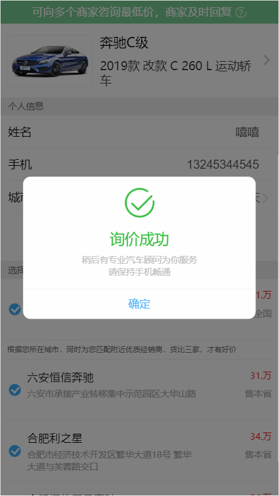
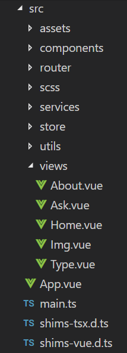

# wheels
汽车报价大全

## 技术点
* vue (3.0)
* TypeScript
* Vue Router & Vuex

## 运行
>npm install
安装项目依赖包

> npm run serve
运行开发环境

## 来一波效果图片








## 页面功能展示
> * 首页 (展示A-Z所有车系列表,楼层效果的实现)
> * 车系列表 (点击每条车系数据可进入侧边栏详情)
> * 详情页 (每辆车的详细信息)
> * 询问底价 (提供给客户的更优惠的选择)
> * 车系类型 
> * 城市列表
> * 询底价成功

## 项目的重点功能
> * 骨架图
> * 页面动画
> * 图片懒加载
> * 图片的预加载
> * 节流
> * 防抖

## 目录结构

> * src => 入口文件
> * component => 组件划分 
> * router => 路由配置
> * scss => 放置公共的scss
> * services => 接口请求
> * store => 请求处理
> * utils => 工具类
> * views => 视图
> * App.vue => 主页面
> * main.ts => 入口配置

## 踩过的坑

### 1.px转rem
```
var fun = function (doc, win) {
      var docEl = doc.documentElement,
        resizeEvt = 'orientationchange' in window ? 'orientationchange' : 'resize',
        recalc = function () {
          var clientWidth = docEl.clientWidth;
          if (!clientWidth) return;
          //这里是假设在750px宽度设计稿的情况下，1rem = 100px；
          //可以根据实际需要修改
          docEl.style.fontSize = (clientWidth / 750) * 100 + 'px';
        };
      if (!doc.addEventListener) return;
      win.addEventListener(resizeEvt, recalc, false);
      doc.addEventListener('DOMContentLoaded', recalc, false);
    }
    fun(document, window);
```

### 2.图片请求错误
```
<meta name="referrer" content="no-referrer" />(可添加)
```